# Flowcharts and Pseudocode

- **Flowcharts** - Diagram to represent solutions of problem.
- **Pseudocode** - Pseudocode is a detailed yet readable description of what a computer program or algorithm should do.

## Common Flowchart Symbols and Their Functions

| Symbol | Name | Function |
|--------|------|----------|
|  | Oval / Start-End | Represents the beginning or end of a program |
| 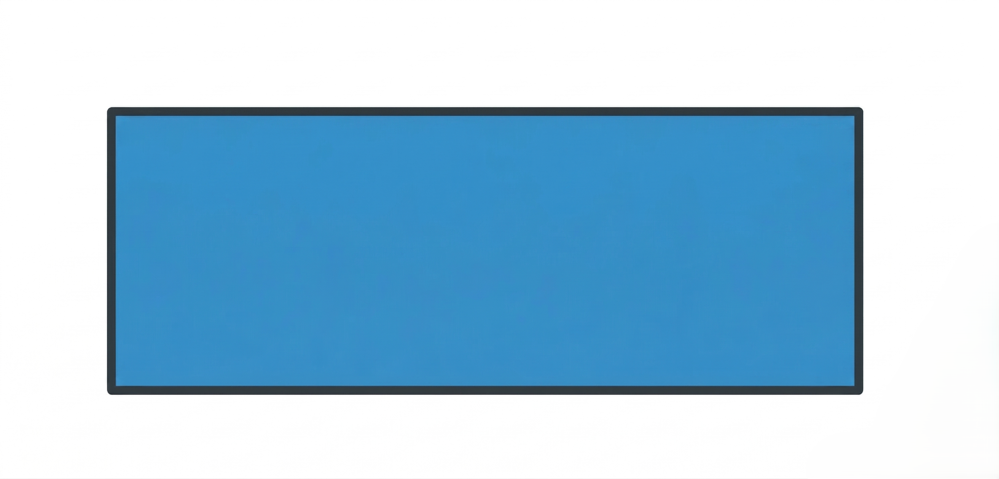 | Rectangle / Process | Denotes a calculation, operation, or action step |
|  | Arrow / Flow Line | Indicates the direction of flow between steps |
| 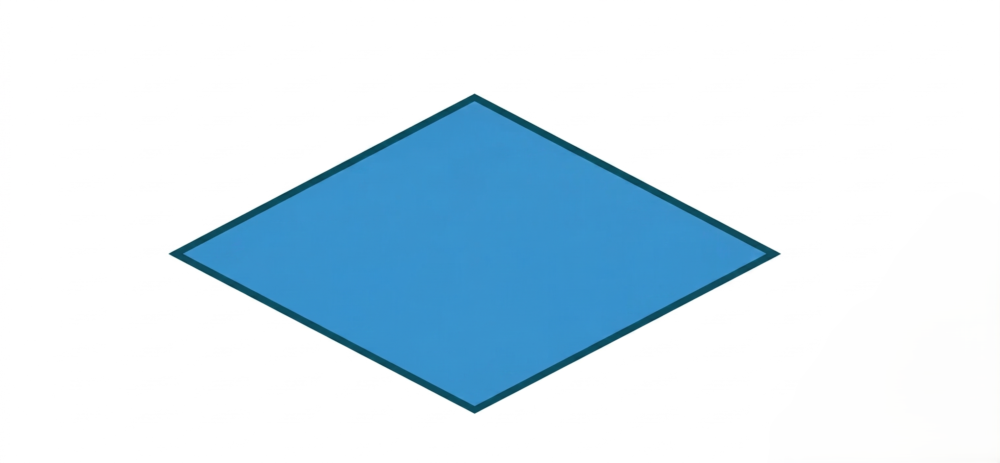 | Diamond / Decision | Represents a yes/no or true/false condition |
| 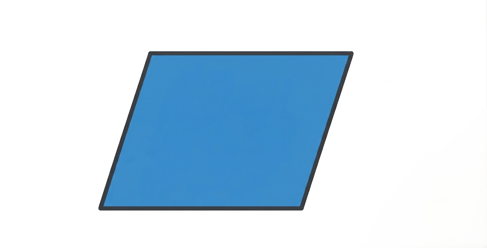 | Parallelogram / Input-Output | Used for reading input or displaying output |

## 1. Sum of 2 Numbers

### Pseudocode

1. Start
2. Input numbers, a & b
3. Calculate sum = a + b
4. Print sum
5. Exit

### Flowchart

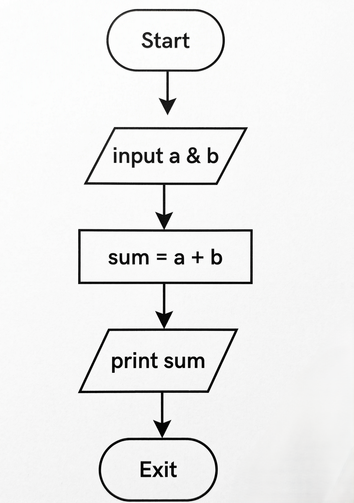

## 2. Calculate Simple Interest

### Pseudocode

1. Start
2. Input principal (p), rate (r) & time (t)
3. Calculate SI = (p * r * t) / 100
4. Print SI
5. Exit

### Flowchart

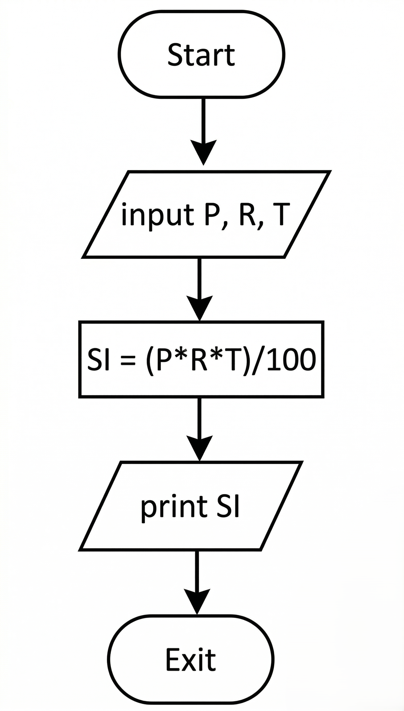

## 3. Find Maximum of 3 Numbers

### Pseudocode

1. Start
2. Input a, b & c
3. <br>

    ```
    If a > b then
        If a > c then
            Print a
        Else
            Print c
    Else
        If b > c then
            Print b
        Else
            Print c
    ```
4. Exit

### Flowchart

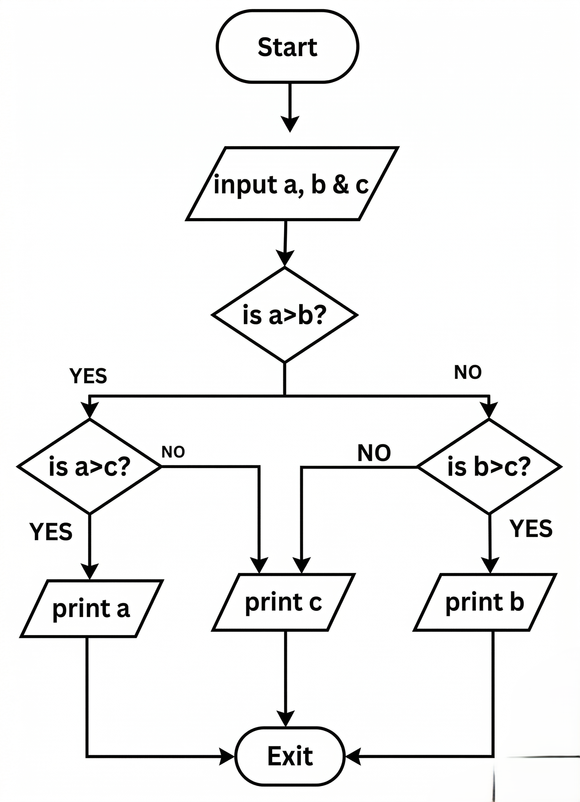

## 4. Find if a Number is Prime or Not

### Pseudocode

1. Start
2. Input n
3. Let div = 2
4. <br>

    ```
    While div < n do
      If n % div == 0 then
        Print "not prime"
        Exit
      Else
        div = div + 1
    ```
5. Print "prime"
6. Exit

### Flowchart

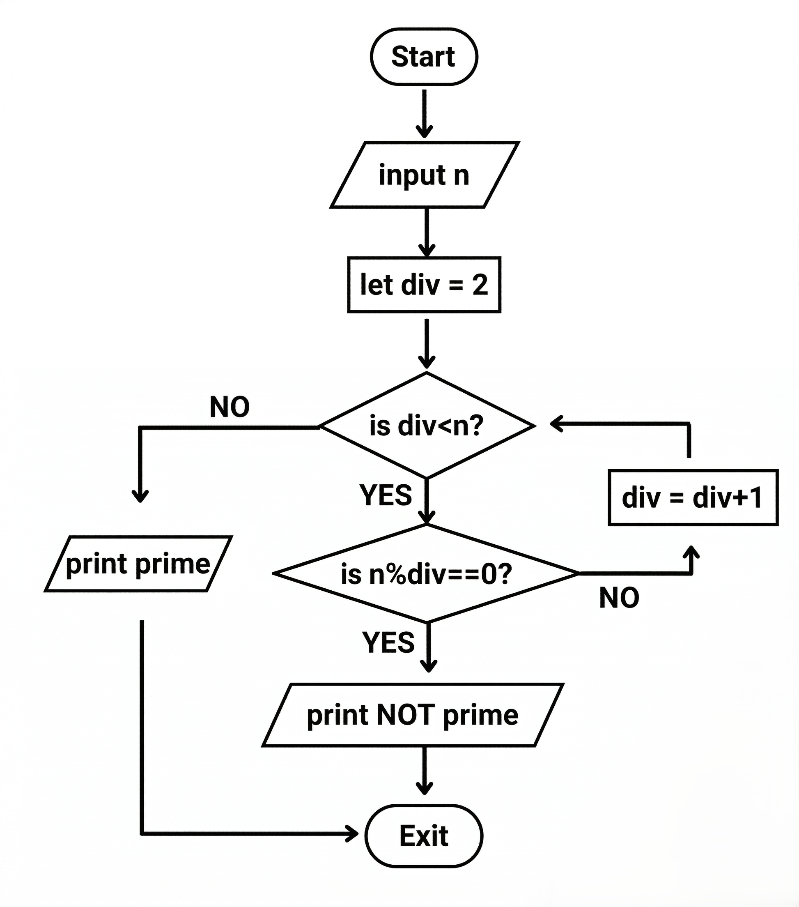

## 5. Sum of First N Natural Numbers

### Pseudocode

1. Start
2. Input n
3. Let val = 1 & sum = 0
4. <br>

   ```
   While val <= n do
     sum = sum + val
     val = val + 1
   ```
5. Print sum
6. Exit

### Flowchart

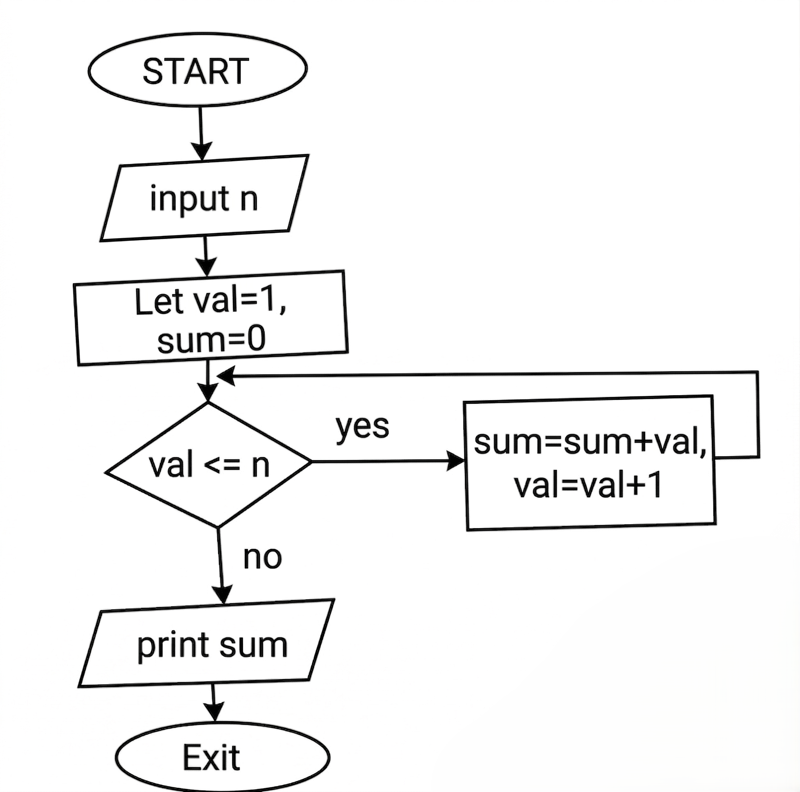

## 6. Calculate the Area of a Circle

### Pseudocode

1. Start
2. Input radius r
3. Calculate area = 3.14 * r * r
4. Print area
5. Exit

### Flowchart

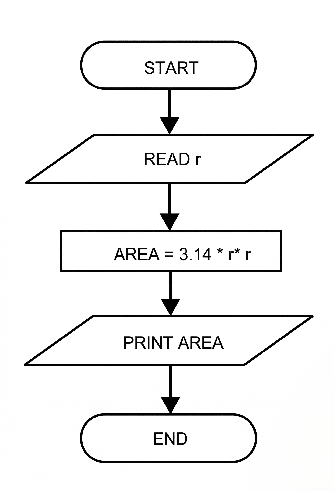

## 7. Find the Greatest from 2 Numbers

### Pseudocode

1. Start
2. Input A, B
3. <br>

   ```
    If A > B then
        Print A
    Else If B > A then
        Print B
    Else
        Print "Both are equal"
   ```
4. Exit

### Flowchart

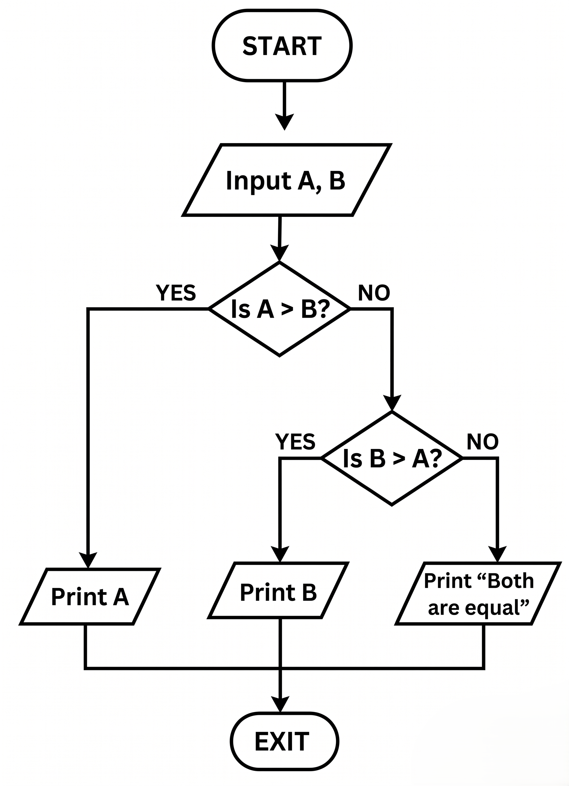

## 8. Print the Even Numbers Between 9 and 100

### Pseudocode

1. Start
2. Set num = 10
3. Print num
4. Set num = num + 2
5. <br>

   ```
   If num <= 98 then
     Go to step 3
   Else
     End
   ```
6. Exit

### Flowchart

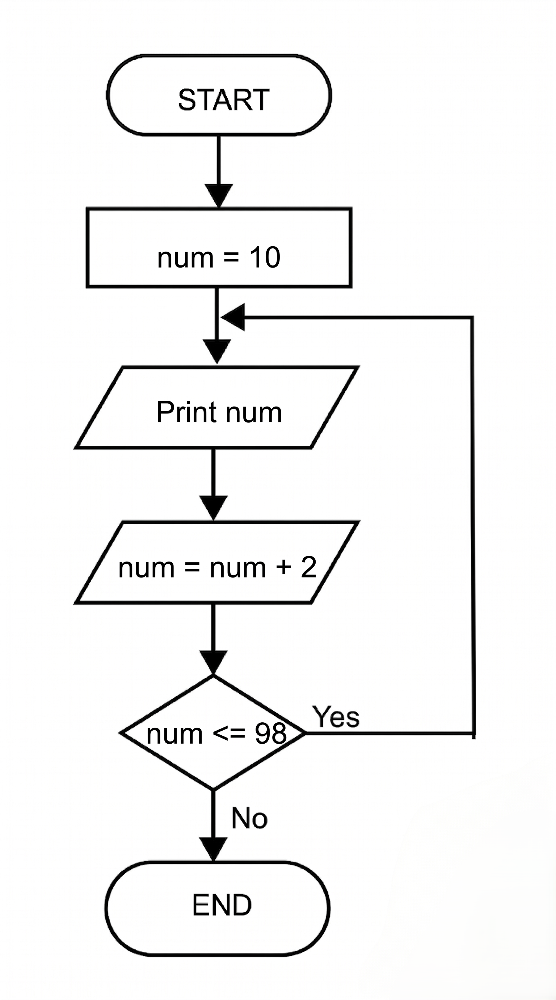

## 9. Calculating the Average from 25 Exam Scores

### Pseudocode

1. Start
2. Set Sum = 0, C = 0
3. Enter Exam Score, S
4. Set Sum = Sum + S
5. Set C = C + 1
6. <br>

    ```
    If C = 25 then
        Set Avg = Sum / 25
        Print Avg
        Go to Step 7
    Else
        Go to Step 3
    ```
7. Exit

### Flowchart

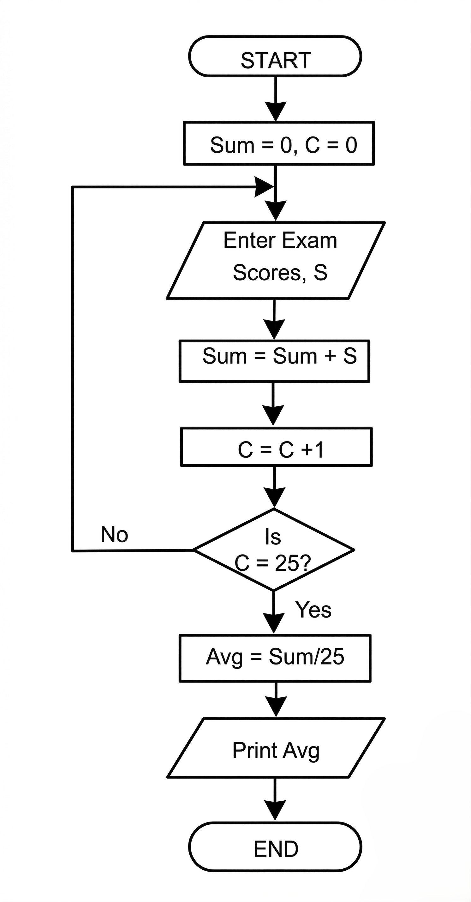
